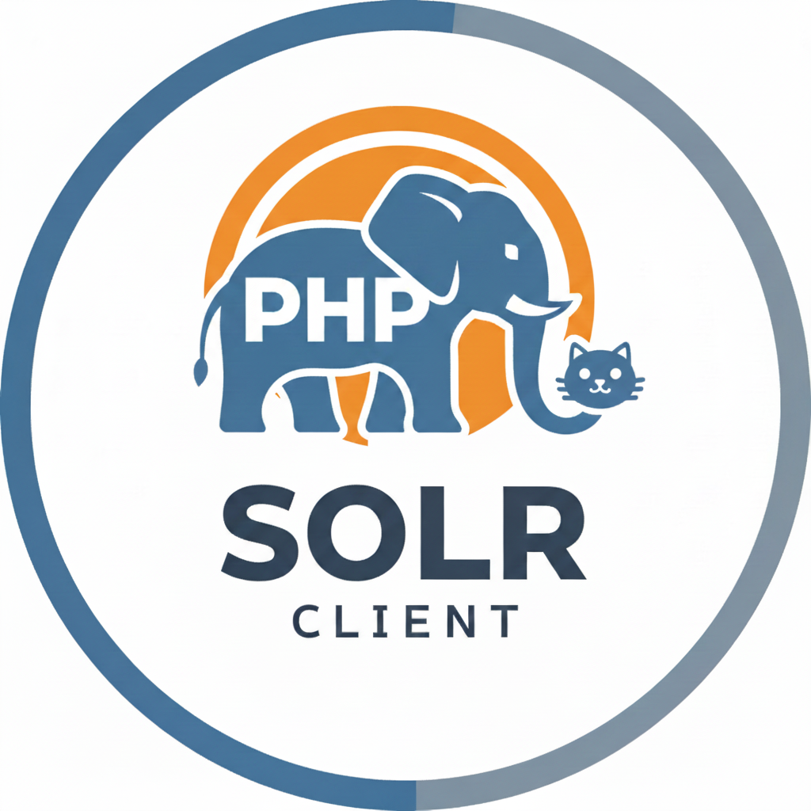
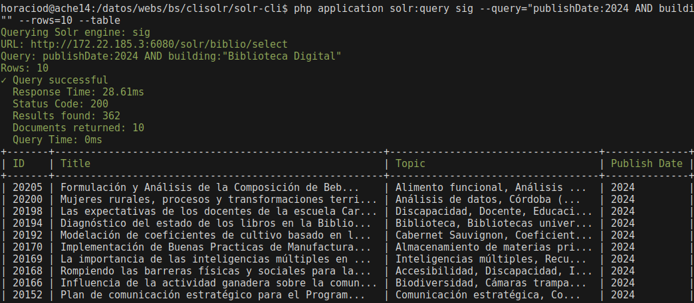

# SOLR-PHP-CLI

Simple tools to retrieve information from a SOLR server.

## Commands

This repository provides CLI tools for interacting with SOLR servers:

- `query` - Execute search queries against SOLR,  with table export
- `index` - Index documents into SOLR collections (Todo!)
- `delete` - Remove documents from SOLR (TODO!)
- `backup` - Create backups of SOLR collections
- `status` - Check SOLR server status and health
- `config` - Manage SOLR configuration settings

## Sample output




## Dev
- laravel zero
- opencode 
- visual code 

## License

SOLR PHP CLIENT is an open-source software licensed under the MIT license.


##Documentation
```php 
/**
 * SolrPingCommand
 *
 * A console command for pinging the Solr search server to verify connectivity
 * and health status.
 *
 * This command sends a ping request to the configured Solr instance to determine
 * if the server is accessible and responding to requests. Useful for monitoring
 * and debugging Solr connectivity issues.
 *
 * Usage:
 *   php solr-cli solr:ping
 *
 * @package App\Commands
 */
```
```php
/**
 * SolrQueryCommand
 *
 * A console command for executing search queries against a Solr server with
 * support for table export functionality.
 *
 * This command allows you to perform advanced search queries on your Solr
 * collections, with options to format and export results as tables for easy
 * analysis and reporting.
 *
 * Usage:
 *   php solr-cli solr:query {query} {--collection=default} {--export=table}
 *
 * @package App\Commands
 */
```
```php
/**
 * SolrBackupCommand
 *
 * A console command for creating backups of SOLR collections.
 *
 * This command allows you to create backups of your SOLR collections to
 * prevent data loss and enable disaster recovery.
 *
 * Usage:
 *   php solr-cli solr:backup --query="category:books AND year:2023"
 *
 * @package App\Commands
 */
```

